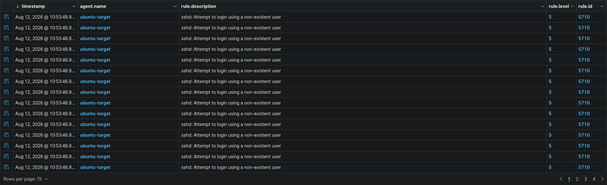
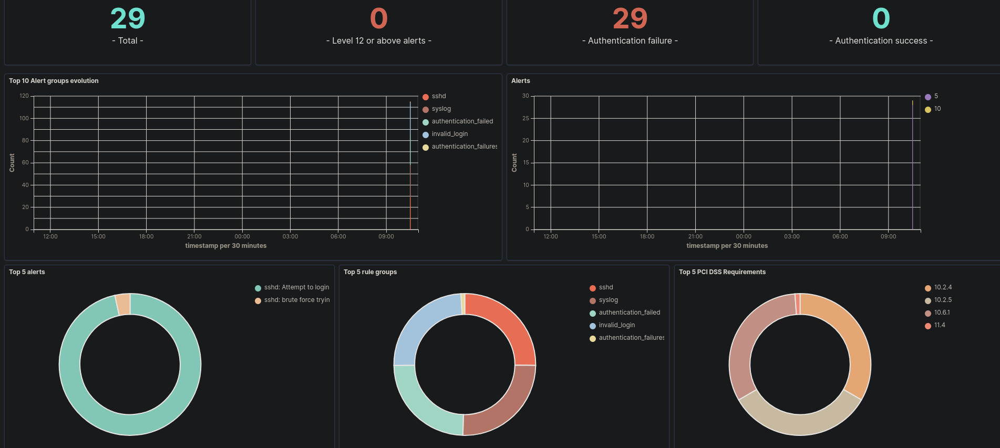

There was one IP on the network, and it was answering on port 22.

That was all I had. No password, no username worth trusting, no idea what was behind it — just a box sitting quietly on an address I'd found, with SSH open like an unlocked door at the end of a hallway. I had to know what was on it.

So I did the unsubtle thing. I pointed myself at the login and started guessing — name after name, straight down the list, the terminal throwing the same rejection back at me each time. _Permission denied._ Again. _Permission denied._ Again.

Twenty-nine tries in, I stopped. The box wasn't giving. Whatever was on it would stay a mystery. No harm done — just another server that didn't feel like talking. I closed the terminal and moved on.

---

Except the box _was_ talking. Just not to me.

Every one of those attempts had been picked up, parsed, and filed the moment it landed. The Ubuntu server I'd been hammering had a Wazuh agent on it, quietly shipping every failed login off to a manager that was building a very tidy record of exactly what I'd just done — timestamped down to the second, all of it landing inside a two-second window just after 10:53.

Rule 5710, level 5, over and over: _sshd: Attempt to login using a non-existent user._ I hadn't even been guessing passwords for a real account — I'd been throwing usernames at the door that were never there in the first place, and the box noted down every single one.

Twenty-nine total events. Twenty-nine failures. Zero successes. The detection I'd built to catch exactly this kind of thing had done its job on the first real try — right down to naming the technique and fingering the agent it came from.

The victim was mine. The attacker was me. I'd built this whole thing — Proxmox on the metal, an Ubuntu VM on top of it, a Wazuh agent on the VM reporting home — and then walked straight into my own trap to see if the trap worked.

It did.

That's the whole point of this one. It wasn't a sophisticated attack — twenty-nine manual guesses at a box that was never going to open. But it was recorded, correctly identified, and attributed, and that's the win I was actually after.

**What's next:** a Kali VM as a proper attacker box, and some real defence-in-depth hardening to make the victim less of a pushover. Further out, I want to build a purple-team setup and run simulations against myself — and eventually hand the attacker's side to an AI and see what it does. That last one has me a little too excited.

For now, I'll take it: I set up a victim, attacked it, and caught myself in the act.
