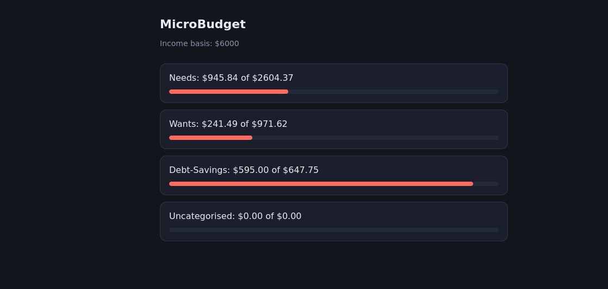

I started MicroBudget for two reasons that eventually became one.

The first: I wanted to learn how to actually build an app. Not follow a tutorial and copy the answers — build something real, from scratch, that I'd actually use. The second: I was sick of the budgeting apps on offer. There are a few Australian ones, but they were either overcomplicated or missing the things I wanted. Nothing quite fit.

Then I heard about Caleb Hammer's Dollarwise app, and something clicked — I could build my own, inspired by his approach but with my own flair. The unlock came when I realised Up Banking supports Personal Access Tokens. That meant I could pull my own transaction data directly and build something around it, instead of manually entering everything like a caveman.

There was a further third thing too, which I didn't know until I was creating this app and it's really the heart of it. Even with a budget, I didn't actually know how to get ahead on my savings. So I did some digging and landed on the snowball savings strategy — and I want to build that in, so it doesn't just track where my money went but actually helps me claw forward.

## Who it's for

MicroBudget is built to help me save — but really, it's built for anyone who struggles with it, especially people with ADHD. I want this to work the way my brain works, not the way a spreadsheet wishes my brain worked. Long-term, I'd like it to be something most people in Australia could use, because I genuinely can't find anything on the market that does what I'm trying to do here.

## Where it's at

Right now there's a basic but functioning tracker. It reads my accounts and transactions from Up Banking and automatically sorts spending into buckets — Needs, Wants and Debt-Savings — with anything it can't categorise landing in its own bucket so nothing gets quietly miscounted. That sorting is automated, which was the whole point: the less manual effort, the more likely I'll actually stick with it.

Under the hood, Python does the heavy lifting — the calculations, writing the results out to JSON and CSV, and talking to the Up Banking API. There's a working dashboard now, served by FastAPI, showing each bucket against its target. It installs on my phone as a PWA and it's reachable from anywhere through a Cloudflare tunnel, locked to my email address.

## The honest part

This is the first time I've really gone deep with Python, and the whole thing has been a massive learning curve. But I learn best by throwing myself in the deep end — give me a real problem I care about and I'll figure out the parts I need as I go. That's how MicroBudget has been built so far, and it's how the rest of it will get built too.

## The parts that were actually interesting

So far, I've found that the float bug I encountered was pretty unique. At one point I was totalling a month's spending and got this: `-296.3500000000001`

Nothing was broken - that's just what happens when you add decimals in binary. Something I wasn't aware of was that computers store numbers in base 2 and some fractions don't fit. it's the same as writing one third as a decimal: 0.3333.... never terminates, so you round it off. In binary, 0.1 and 0.2 are the ones that don't terminate. Every amount I stored was a fraction of a cent wrong, and the error compounded with each addition.

After some digging, I found that this is a problem banking systems avoid by operating off this rule: Don't store dollars. Store cents, as whole numbers. `-4503` instead of -45.03. Integers are exact, so no matter how many you add the total is exact too - and you divide by 100 once, at the very end, purely to display it. This is why my code is full of `valueInBaseUnits`, and why the JSON my app serves looks like it's quoting prices in a country with terrible inflation.

Another unique bug I encountered was due to internal transfers counting as spending. Up banking has two internal transfer systems worth mentioning here: Round Ups and Saver movements. Round Ups is an auto-saving feature within Up banking that rounds up the nearest dollar and sets the difference aside into a designated saver. For example, if I purchased an item for $7.70, RoundUps would take effect, set the total purchase to $8, then put the $.30 into a designated saver. It's a neat feature that helps passively save money. Savers are Up's named sub-accounts - Rent, groceries, car rego etc. - and moving money between them is a transfer, not spending.

However, during initial testing, both of these features were appearing as transactions and listed them as negative amounts. To the code, it looked no different to buying petrol. So the first working total counted my own money moving between my own pockets as money spent.

The fix was one condition. Every transaction already carries a `transferAccount` field — null when money genuinely left, populated with the destination account when it only moved — so I check that before counting anything as spending. One line, and the phantom spending disappeared.

The lesson was that the code did exactly what I told it to — my definition of spending was the thing that was wrong. "Negative number" and "money I spent" turned out to be different things. The API told me what happened, not what it meant.

## What kept breaking

Most of my early errors weren't Python errors. They were me writing bash in a Python file.

I'd learned the Up API through curl, so my first attempts were full of things that mean something in a terminal and nothing in a script: backslash line continuations, `$UP_TOKEN` sitting inside a string waiting for a substitution that was never coming, `-H` flags where a dictionary should have been. Python doesn't fail helpfully when you do this. It fails in ways that look like they're about something else.

The second recurring mistake was subtler: confusing the label with the data. I wanted to check whether a transaction was an internal transfer, so I wrote a condition testing `"transferAccount"` — the word, in quotes — against None. A word is never None, so the condition was permanently false and the filter silently did nothing. Python actually warned me: `SyntaxWarning: "is" with 'str' literal`. I didn't read it. That same mistake showed up three different ways across three sessions before it stuck.

Third, and most often: indentation. In Python, indentation is structure — it's not formatting, it's the thing that decides what's inside a loop. I lost count of how many times my summary printed exactly once, using the last transaction's values, because the code that should have been inside the loop was sitting just outside it.

Two habits fixed most of this.

The first: when an error names a key, print the actual structure and read it. I spent twenty minutes once shuffling brackets around trying to reach an amount, on the assumption it was nested inside the description. It wasn't — they're siblings, sitting side by side. Thirty seconds of `json.dumps(transaction, indent=4)` would have shown me that. Guessing feels faster than looking. It isn't.

The second: when you can't tell whether the problem is your code or your credentials, run the same request through a different tool. My script started failing with `KeyError: 'data'` — apparently a problem with how I was reading the response. It wasn't. Feeding the same token to curl produced the same failure, which meant the code was innocent and the token was dead. If both tools fail identically, the thing they have in common is the culprit.

Neither of those is a Python lesson. They're the same instinct — stop reasoning about what the data probably is, and go look at what it actually is.

## What's next

Three things, in order.

Real-time. Right now the app only knows about a transaction when I open it and it goes asking. Up supports webhooks, so it can be told the moment I tap my card instead — which also means it can start keeping its own record rather than re-fetching everything each time.

Tags written back. The buckets currently live only in my app. Up lets you write tags onto transactions through the API, so the categorisation can show up in the Up app too — the sorting happens once and appears in both places.

Snowball. The reason I started. Once the tracking is solid, the actual savings strategy goes in.
