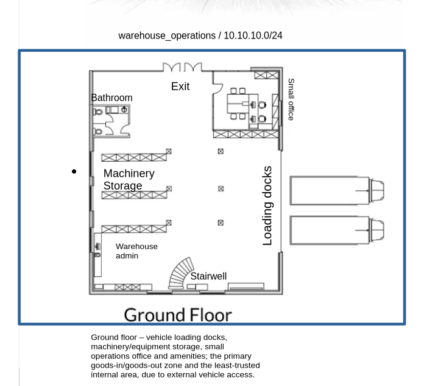
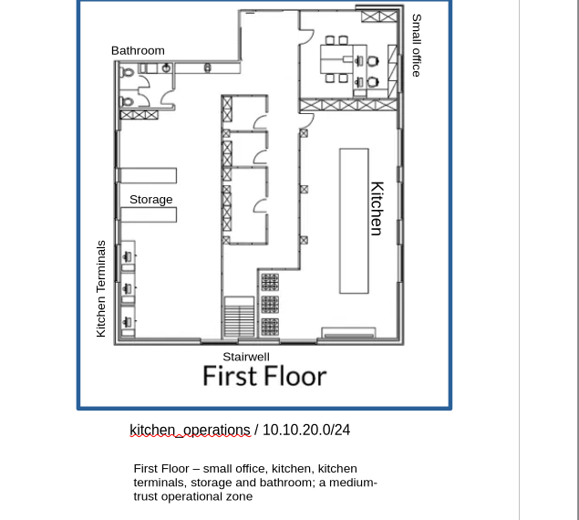
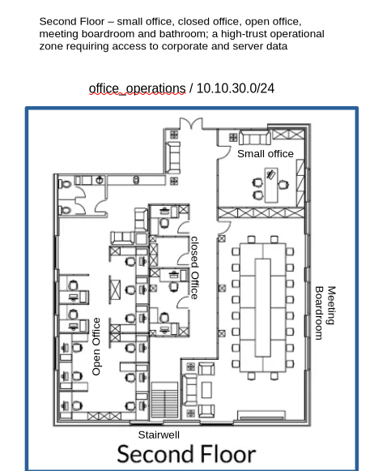

# Cybersecurity Capstone — VIP Events

This is Stage 1 of a cybersecurity proposal I built as the capstone for the Microsoft Cybersecurity Analyst Professional Certificate. The brief: design a secure IT system for **VIP Events**, a fictional catering and food-equipment leasing company expanding into a new three-storey building with 21 permanent staff plus transient event personnel. The design applies defense in depth (DiD), Zero Trust, and Microsoft Entra ID (formerly Azure AD).

## Assessing the requirements

Enhancing the company's cybersecurity to safeguard its data and systems is essential to protecting the company itself. VIP Events has significant customer/event data, financial information, the VIP Foods application, and leasing/equipment records. As the company grows, so do the risks — such as theft of equipment, phishing, and unauthorised physical access to a large, publicly accessible premises.

Workforce growth is itself a security event: 21 permanent staff across four distinct functions (loading dock → kitchen → office → executive), *plus* rotating transient personnel, expands the attack surface and makes access isolation between groups necessary.

One of the most significant risks is the transient staff, as there are up to 30 short-term contractors with mobile devices touching the network. Moving to a new building lets the company build a network from scratch and correct any issues carried over from the previous location. This allows the company to focus on principles like defense in depth (DiD), just-in-time (JIT) access, and Zero Trust.

## Building structure and network design

VIP Events' new premises spans three floors, each serving a distinct function: the ground floor (warehouse and loading), the first floor (kitchens), and the second floor (offices).

The **ground floor** (see Figure 1) primarily functions as the loading docks and machinery storage area. It contains a small office for administrative work as well as an additional PC near the stairwell. Because it is exposed to external vehicle access and serves as the primary goods-in/goods-out zone, it is the least-trusted area in the building. This warrants its own subnet, `warehouse_operations` (10.10.10.0/24), so that a compromise in this exposed zone cannot spread to any higher-trust area.

The **first floor** (see Figure 2) is the kitchen area, containing a set of terminals, storage, the kitchens themselves, and a small office. It is a medium-trust operational zone: the kitchen terminals and small office require internet access for inventory purposes, but have no need to reach the second-floor offices or the server. The floor is therefore segregated under `kitchen_operations` (10.10.20.0/24) and isolated so that a compromise here cannot pivot to higher-trust zones.

The **second floor** (see Figure 3) is the office area, containing an open office, a closed office, a boardroom, and a small office. It is a high-trust area and, because it requires access to the server and holds sensitive corporate data, it is segregated under `office_operations` (10.10.30.0/24), keeping the lower-trust warehouse and kitchen zones from accessing corporate data directly.

Two further subnets are not shown on the floor plans but are essential to the design:

- **`server_infrastructure` (10.10.40.0/24)** — hosts the VIP Foods app backend and core services. This is the highest-trust zone and operates a deny-by-default posture, permitting only explicitly required traffic. As the "crown jewels" of the network, it must be reachable only through tightly controlled paths.
- **`network_management` (10.10.50.0/24)** — contains all switch, access point, and firewall administrative interfaces. Isolating the management plane is critical: if a user endpoint is compromised, it must not be able to reach the equipment that runs the network.

All subnets use deny-by-default routing between them, so segmentation is enforced at the routing layer rather than assumed.

| Subnet | Address | Purpose | Segregation justification |
|---|---|---|---|
| warehouse_operations | 10.10.10.0/24 | Loading dock, machinery storage, ops office/PC | Least-trusted; external vehicle access; contain any breach away from higher-trust zones |
| kitchen_operations | 10.10.20.0/24 | Kitchen terminals, storage, kitchen office | Medium-trust; isolate so a compromise cannot pivot to office or server |
| office_operations | 10.10.30.0/24 | Open/closed office, boardroom, admin | High-trust; holds sensitive corporate data; separated from lower zones |
| server_infrastructure | 10.10.40.0/24 | VIP Foods app backend, core services | Highest-trust; deny-by-default; crown jewels |
| network_management | 10.10.50.0/24 | Switch/AP/firewall admin interfaces | Isolated so a compromised endpoint cannot reach network gear |

*Figure 1: Ground floor layout and warehouse_operations subnet (10.10.10.0/24).*

*Figure 2: First floor layout and kitchen_operations subnet (10.10.20.0/24).*

*Figure 3: Second floor layout and office_operations subnet (10.10.30.0/24).*

## Wireless network configuration

All wireless segments are separated at the VLAN level with deny-by-default routing to internal subnets. Corporate uses WPA3-Enterprise (802.1X) tied to Entra ID; guest and contractor segments use client isolation and are restricted to internet access only. The IoT/Operational segment is provisioned in case VIP Events deploys IoT devices.

| SSID / Segment | VLAN/Subnet | Purpose | Allowed device types | Segregation justification |
|---|---|---|---|---|
| Corporate_WiFi | 10.10.60.0/24 | High-trust segment; Zero Trust hook via WPA3-Enterprise / 802.1X authentication tied to Entra ID, so only compliant devices connect | Managed tablets, laptops, company phones | Accesses sensitive corporate data and the server, so it requires the highest scrutiny and defence |
| Contractor_WiFi | 10.10.70.0/24 | Lets contractors connect to do their job without being on the same network as corporate; internet access only, with no access to internal subnets | Contractor mobiles (BYOD) | Low-trust segment; contractors need internet to perform their duties but should never reach the corporate network in case an endpoint is compromised |
| Guest_WiFi | 10.10.80.0/24 | Lets guests connect to the internet without any risk to Corporate_WiFi | Visitor personal devices | Guests are typically lower risk (one-off visitors) and need internet only — no app or internal access; client isolation enabled |
| IoT/Operational | 10.10.90.0/24 | A separate network for IoT devices to ensure smooth operation without being connected to any other network, if deployed | Wireless scanners, smart kitchen equipment | IoT and operational devices can't be patched or monitored like managed endpoints, so they're isolated to contain any compromise |

## Access control and security policies

Access control is applied across three layers, with controls increasing in stringency as the trust level of each zone rises.

1. **Network layer** — VLAN isolation, firewall rules between subnets (deny-by-default), inter-VLAN routing restrictions, NAC (Network Access Control) on wired ports, 802.1X port authentication.
2. **Identity layer** — Entra ID group membership; corporate Wi-Fi requires a compliant, enrolled device and a valid Entra identity, plus MFA (multi-factor authentication); contractor and guest segments don't touch internal authentication at all.
3. **Device layer** — device compliance requirements (managed vs unmanaged), Intune enrolment for company devices, MAM-only for contractor BYOD phones.

The highest-value assets (server and management planes) require the most authentication and isolation, while guest and contractor segments are restricted to internet access only.

| Zone | Network layer | Identity layer | Device layer |
|---|---|---|---|
| warehouse_operations (10.10.10) | VLAN isolation, deny-by-default to higher zones, 802.1X on wired ports | Entra group (equipment handlers/manager) | Managed devices, Intune enrolled |
| kitchen_operations (10.10.20) | VLAN isolation, no route to office/server | Entra group (kitchen) | Managed devices, Intune enrolled |
| office_operations (10.10.30) | VLAN isolation, controlled route to server only | Entra group (office) + MFA | Managed devices, Intune enrolled |
| server_infrastructure (10.10.40) | Deny-by-default, explicit allow-list only, no direct user access | Admin identities only + MFA | Managed, most restricted |
| network_management (10.10.50) | Fully isolated management plane, jump-host access only | Admin identities only + MFA | Privileged access workstations only |
| Corporate_WiFi (10.10.60) | VLAN isolation, deny-by-default to internal | Entra group (Corporate) + MFA + WPA3-Enterprise / 802.1X | Compliant + enrolled required |
| Contractor_WiFi (10.10.70) | VLAN isolation, internet only | No internal authentication | Unmanaged BYOD, MAM app protection only |
| Guest_WiFi (10.10.80) | VLAN isolation, client isolation, internet only | None | Unmanaged, no access to anything internal |
| IoT_Operational (10.10.90) | VLAN isolation, no inbound to user zones | Device certificates where possible | Unmanaged/unpatched, contained |

The network-layer controls (VLANs, firewall rules, 802.1X) are technical configuration applied during the network build. The following are identity and device **policies** to be formally defined and enforced in Stage 5:

- **Conditional Access policies** — require MFA and a compliant device before accessing corporate resources (office_operations, server); block sign-ins from outside expected conditions.
- **Sign-in risk / Identity Protection policy** — block or challenge risky sign-ins.
- **Device compliance policies** — define what makes a managed device compliant (encryption, PIN, minimum OS, not jailbroken), enforced via Intune across all managed-device zones.
- **MFA enforcement policies** — require multi-factor authentication for all staff, with stricter enforcement for privileged/admin identities and server access.
- **App Protection / MAM policies** — protect VIP Foods app data on unmanaged contractor BYOD phones (Contractor_WiFi, 10.10.70.0/24) without enrolling the whole device.
- **Access package / entitlement with auto-expiry** — grant transient staff time-boxed access that automatically revokes after their engagement (the TempRole), enforcing JIT access.
- **Authentication / password policy** — set password/passwordless requirements.
- **Access review policy** — periodically review group memberships and role assignments to confirm access is still appropriate (least privilege over time).

## User roles and access requirements

| Group | Department | Number of people |
|---|---|---|
| Equipment Handler | Operations | 4 |
| Equipment Manager | Operations | 1 |
| Chef | Kitchen | 10 |
| Head Chef | Kitchen | 1 |
| Catering Manager | Operations | 1 |
| Office Worker | Administration | 3 |
| CEO | Executive | 1 |
| Temp Worker | Temp | Variable |

Each group is granted isolated, least-privilege access to only the functions their role requires:

| Group | Access requirements |
|---|---|
| Equipment Handler | `warehouse_operations` subnet (ground floor); EquipHandlersRole in the app (equipment tracking/handling); tablets. No access to kitchen, office, or corporate systems. |
| Equipment Manager | `warehouse_operations` subnet; EquipManagerRole (full equipment oversight); desktop + tablet. Broader equipment access than handlers, but no kitchen or office access. |
| Chef | `kitchen_operations` (first floor); ChefsRole (food prep/kitchen management); tablets. No equipment, office, or admin access. |
| Head Chef | `kitchen_operations`; HeadChefRole (elevated kitchen management); desktop + tablet. No cross-department access. |
| Catering Manager | Operations (catering coordination); CateringManagerRole (event/menu/logistics planning); desktop + tablet + phone. Cross-touches events but not equipment internals or corporate finance. |
| Office Worker | `office_operations` (second floor); OfficeWorkersRole (admin/data management); desktops. Access to admin systems, no operational/kitchen access. |
| CEO | `office_operations` + server access; CEORole (unrestricted app access); desktop, laptop, tablet, phone. Full oversight — the one exception to strict isolation, justified by the role. |
| Temp Worker | `contractor_wifi` (isolated, internet + app only); TempRole (time-boxed, day-of tasks only, auto-expiring); BYOD mobiles. Least access, JIT, no internal anything. |

## Physical security (Layer 0)

Layer 0 is the outermost layer of defense in depth, so it stops threats **before** they ever reach the network, identity, or data layers. A locked server room means a physical intruder can't bypass all the VLAN segmentation by simply plugging in. Physical access defeats logical controls, so this layer is the foundation everything else sits on.

VIP Events should incorporate the following measures to secure Layer 0 against physical intrusion:

- **Controlled entry** — badge or access cards for staff, reception sign-in for guests, and locked external doors.
- **Loading dock (highest physical-risk zone)** — controlled door access, staff supervision of deliveries, CCTV covering the dock, and doors between the dock and internal areas that don't stay propped open.
- **Server / comms room** — locked and restricted to admin/IT only, ideally with its own access log.
- **CCTV** — coverage of entries, loading docks, storage, and the server room.
- **Access control per floor/zone** — badge access restricting which floors each group can reach, mirroring the network segmentation so a chef cannot physically walk into the second-floor offices any more than they can reach `office_operations` on the network.
- **Device physical security** — cable locks on desktops, secure storage for tablets/laptops when not in use, especially the CEO's laptop.
- **Visitor management** — sign-in, escorts, and visitor badges for boardroom/conference guests.
- **Secure disposal** — shredding and secure wiping of decommissioned devices.
- **Environmental** — fire suppression, UPS for the server room, and alarm/intrusion detection on external doors with after-hours monitoring.

---

*This is Stage 1 of a five-stage capstone. [Stage 2](/blog/vip-events-stage-2-aad-setup/) (Entra tenant setup) follows, along with Stages 3–5 (roles and access, application integration, and policy implementation).*
