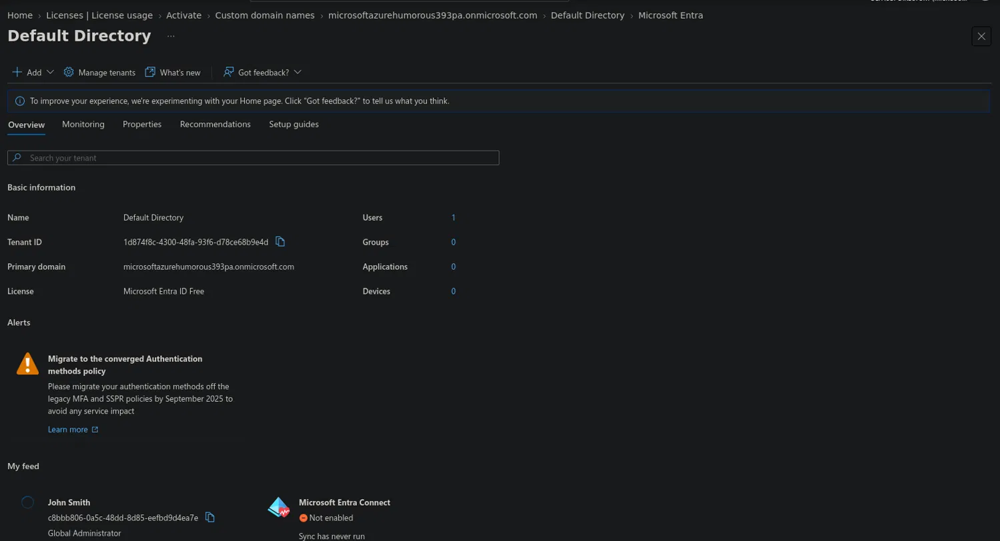
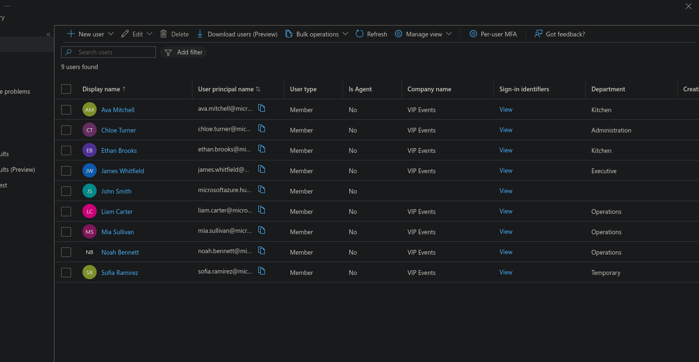
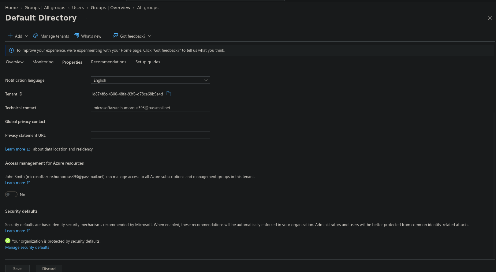
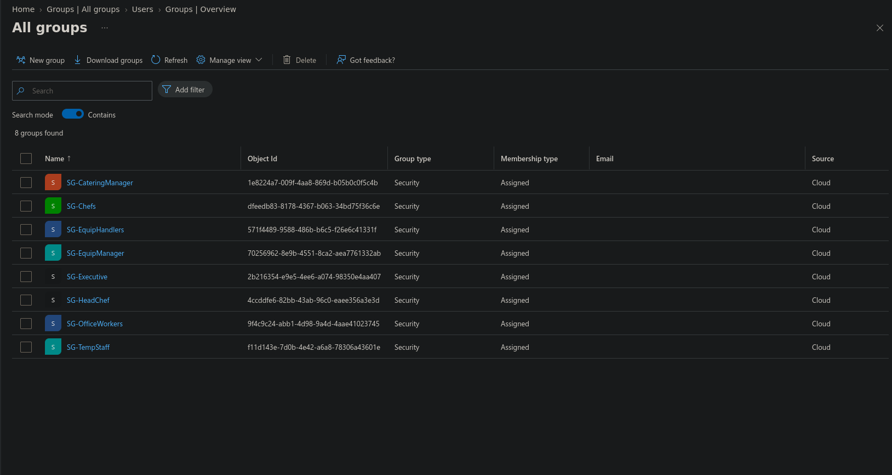

# Cybersecurity Capstone — VIP Events (Stage 2)

This is Stage 2 of the VIP Events cybersecurity capstone, following on from the network design in [Stage 1](/blog/vip-events-stage-1-company-requirements/). Where Stage 1 laid out the network zones, this stage builds the identity and access foundation those zones depend on, inside a live Microsoft Entra ID (formerly Azure AD) tenant. I built this on the **Entra ID Free tier**, and flagged production recommendations (P1/P2 licensing) everywhere the Free tier falls short — so what follows documents both what's actually built and what a real production deployment would add on top.

## Setting up the tenant

VIP Events sits inside a single dedicated Entra ID tenant (see Figure 1) — the identity boundary that every user, group, and policy in this build hangs off. In this sandbox it's the Default Directory (`microsoftazurehumorous393pa.onmicrosoft.com`), because the tenant can't verify a domain it doesn't actually own. In production, the company would verify its real domain (`vipevents.com.au`) by adding the Entra-provided TXT record (`MS=ms75772806`) to their DNS registrar, so staff sign in and receive email under the company domain rather than the default `.onmicrosoft.com` one.

The licence used here is Entra ID Free, which is enough to create users and groups but stops short of Conditional Access, dynamic groups, and Identity Protection. For a real deployment I'd recommend Entra ID P2 — it includes everything P1 offers (Conditional Access, dynamic groups, MFA policies) plus Identity Protection, Privileged Identity Management, and access reviews, all of which this design leans on later.

Region would be set to Australia at tenant creation, for data residency and regulatory reasons. And because VIP Events is growing, the access model shouldn't stay static: I'd recommend moving to group-based membership driven by dynamic groups (P1+), where membership calculates automatically off user attributes like department — so a new hire inherits the right access the moment their account is created, without anyone having to remember to add them to a group.

*Figure 1: Tenant overview — primary domain and Entra ID Free licence.*

## User accounts

The 21 permanent staff are provisioned as standard **member accounts** — cloud identities native to the tenant. Transient staff need a different lifecycle, since their access is tied to a single engagement rather than ongoing employment: in this build the transient account (Sofia Ramirez) is still a member account, manually disabled once the engagement wraps up, which is as far as the Free tier lifecycle goes. In production I'd handle this through **access packages with automatic expiry** (entitlement management, P2) instead, so transient access is granted for a defined window and revoked automatically — proper just-in-time access, rather than relying on an admin remembering to switch the account off. The administrator account (John Smith) is kept deliberately separate from every staff account and isn't a member of any employee security group, because an admin identity isn't a line-of-business user and shouldn't be treated like one — that's least privilege and separation of duties working as intended.

Every account follows the same `firstname.lastname@domain` UPN pattern (`liam.carter@…`, for example). A predictable naming convention keeps audit logs and sign-in reports readable at a glance and cuts down on support friction; where two names would collide — two James Smiths, say — the convention extends with a differentiator like a middle initial or number (`james.smith2@…`) instead of improvising a one-off format.

Each account also carries real attributes — department, job title, and manager — rather than just a name and a UPN (see Figure 2). Noah Bennett (Equipment Manager) is set as Liam Carter's (Equipment Handler) manager, for instance, modelling the actual reporting line. These attributes aren't cosmetic: department is specifically the hook that drives dynamic group membership in production (P1+), so a new chef created with `department = Kitchen` would land in the Chefs group automatically. They also underpin reporting, auditing, and access reviews — the business's clean answer to "who has access to what, and why."

*Figure 2: Users and their department attributes in the VIP Events tenant.*

MFA is enforced tenant-wide through **Security Defaults** (see Figure 3), which is the only MFA lever available on the Free tier. It requires every user to register for MFA and challenges administrators on sign-in, closing off the most common identity-based attacks. The catch is that Security Defaults is all-or-nothing. In production I'd swap it for granular **Conditional Access** policies (P1) instead, so enforcement can be role-specific — always requiring MFA for the CEO and admin accounts, for example, or blocking sign-ins that fall outside expected conditions. That ties directly into the Conditional Access work flagged for Stage 5.

*Figure 3: Security Defaults enabled, enforcing tenant-wide MFA registration.*

Password security relies on **Entra password protection**, which blocks weak and commonly-breached passwords against Microsoft's global banned list (and can be extended with a custom one). **Self-service password reset** cuts helpdesk load and reset delays; on the Free tier it's available to administrators only, and extending it to every user needs P1. Longer-term, the direction is passwordless — MFA-first authentication through something like Microsoft Authenticator or FIDO2 keys — so passwords stop being the primary factor at all.

## Group-based access control

Grouping by role rather than department is the detail that makes least-privilege isolation actually hold *within* a department, not just between them. Chefs and the head chef both sit in Kitchen, for example, but need different levels of access — which is exactly why this design uses eight role-based security groups instead of four department-based ones.

All eight are **security groups** with **assigned** membership, set up manually on the Free tier. In production these would become **dynamic groups** (P1+) instead, with membership calculated automatically off the `department` and `jobTitle` attributes set up earlier — so a new chef would land in SG-Chefs the moment their account is created. What's built here manually is essentially the manual version of what production would automate.

Each group is the container that grants access to exactly its role's resources — the relevant VIP Foods app role, network zone, and data — and nothing more (see Figure 4). SG-Chefs gets kitchen access and nothing else; SG-EquipHandlers gets equipment functions and nothing else. These groups are the mechanism that actually delivers the least-privilege isolation Stage 1 established on paper.

Transient staff get the most restricted group of all, time-boxed under **SG-TempStaff**. In production, membership would run through **access packages with automatic expiry** (P2), adding temps for a specific engagement and removing them automatically; on the Free tier it's assigned membership with manual removal instead. This is where group-based access control and just-in-time access meet.

These groups are just the containers for now. Stage 3 will map them to VIP Foods app roles (`EquipHandlersRole` → SG-EquipHandlers, and so on), and Stage 5 will target them with Conditional Access policies — the structure goes in now, the permissions follow.

| Security group | Sample member | Will govern (Stage 3) | Isolated from |
|---|---|---|---|
| SG-EquipHandlers | Liam Carter | EquipHandlersRole, warehouse_operations | Kitchen, office, server, exec |
| SG-EquipManager | Noah Bennett | EquipManagerRole, warehouse_operations | Kitchen, office, server |
| SG-Chefs | Ava Mitchell | ChefsRole, kitchen_operations | Equipment, office, server |
| SG-HeadChef | Ethan Brooks | HeadChefRole, kitchen_operations | Equipment, office, server |
| SG-CateringManager | Mia Sullivan | CateringManagerRole | Equipment internals, corporate finance |
| SG-OfficeWorkers | Chloe Turner | OfficeWorkersRole, office_operations | Operations, kitchen |
| SG-Executive | James Whitfield | CEORole (full access) | — (unrestricted, justified) |
| SG-TempStaff | Sofia Ramirez | TempRole (time-boxed) | Everything internal |

*Figure 4: The eight role-based security groups (Security type, Assigned membership).*

That's the identity and access foundation for VIP Events: one dedicated tenant (Free tier here, P2 recommended for production), member accounts under a consistent naming convention with attributes that do real work, tenant-wide MFA through Security Defaults, and eight role-based security groups enforcing least-privilege — including a time-boxed group for transient staff. These groups are the structure Stage 3 will map to VIP Foods application roles, and Stage 5 will target with Conditional Access policies.

---

*This is Stage 2 of a five-stage capstone. [Stage 1](/blog/vip-events-stage-1-company-requirements/) (company requirements and network design) precedes it; [Stage 3](/blog/vip-events-stage-3-roles-and-access/) (roles and access) follows, along with Stages 4–5 (application integration and policy implementation).*
