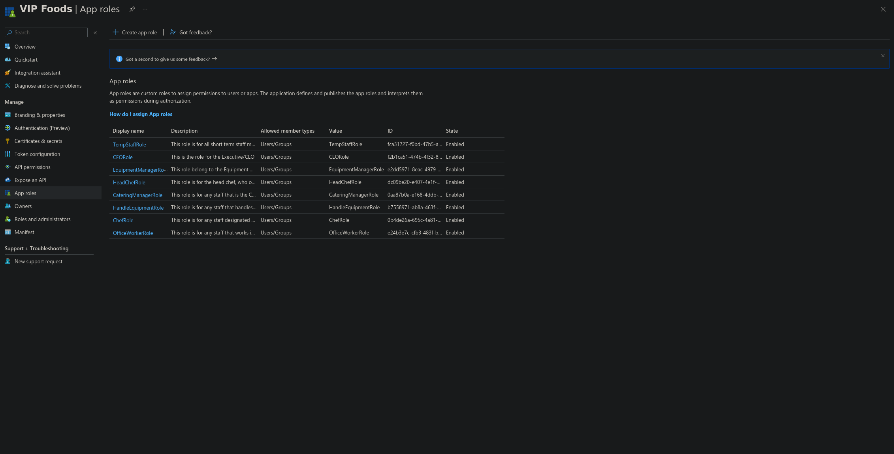
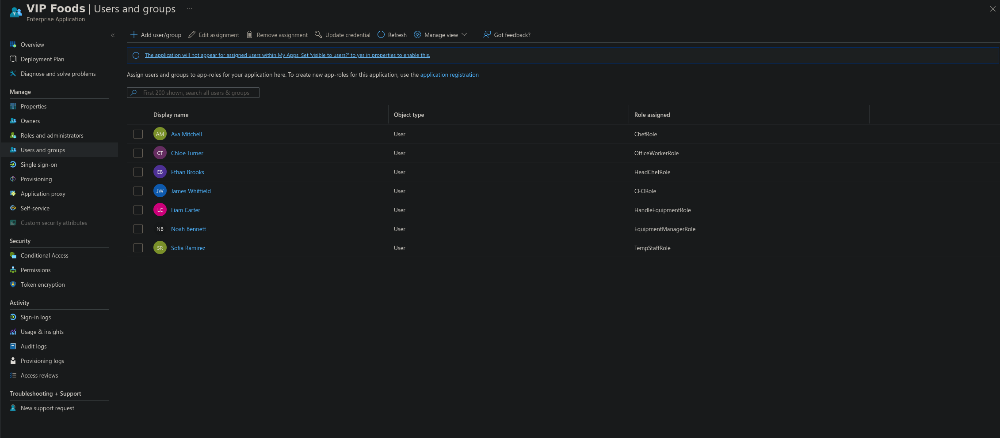

# Cybersecurity Capstone — VIP Events (Stage 3)

This is Stage 3 of the VIP Events cybersecurity capstone, following on from the identity foundation I built in [Stage 2](/blog/vip-events-stage-2-aad-setup/). With the tenant, users, and security groups in place, this stage integrates the fictional VIP Foods application into that identity system and defines the role-based access model that actually governs it. I built this in the same live Entra ID tenant as before, and — same as Stages 1 and 2 — documented the group-based assignment approach as the production recommendation wherever the Free tier gets in the way.

## Application integration and app roles

I registered the VIP Foods application in Entra ID and defined eight app roles inside that registration — one for each employee group established across Stages 1 and 2 (see Figure 1). Each role carries a distinct value that the application reads out of the token at sign-in, so a user's experience is automatically tailored to whatever their role actually permits.

*Figure 1: The eight VIP Foods app roles, all enabled, with Users/Groups member type.*

## Role configuration

Each app role is scoped to a single area of responsibility, so nobody ends up operating outside the functional domain their job actually requires. VIP Foods exposes five functional areas — equipment management, kitchen management, event management, administration, and day-to-day tasks — and every role maps onto those:

- **HandleEquipmentRole (Equipment Handlers)** — day-to-day equipment tracking and handling: logging equipment in and out, recording condition, and updating status. Operational only — no configuration or oversight authority.
- **EquipmentManagerRole (Equipment Manager)** — full oversight of the equipment function: everything a handler can do, plus adding and retiring equipment, scheduling maintenance, and managing the catalogue.
- **ChefRole (Chefs)** — food preparation and kitchen tasks: viewing and updating kitchen and prep data. No authority over equipment, events, or administration.
- **HeadChefRole (Head Chef)** — elevated kitchen management: everything a chef can do, plus coordinating operations, approving menus, and overseeing the kitchen team.
- **CateringManagerRole (Catering Manager)** — event and catering coordination: event planning, menu planning, and logistics. Cross-touches kitchen and event data but has no authority over equipment internals or corporate finance.
- **OfficeWorkerRole (Office Workers)** — administration and data management: the records and admin functions that support the operational teams. No operational or kitchen authority.
- **CEORole (CEO/Owner)** — strategic oversight, with full access to all functional areas. This is the one intentional exception to strict isolation, justified by the role — and because it's the highest-value identity, it's the primary target for the strongest Conditional Access and MFA controls in Stage 5.
- **TempStaffRole (Transient Staff)** — only the specific day-of tasks assigned for an engagement. Access is minimal, time-boxed, and — in production — revoked automatically at the end of the engagement.

The guiding principle is that responsibility defines the role, and the role defines the permissions: no role is granted authority outside the functional area its job requires.

## Permissions per role

Permissions are assigned on a least-privilege basis — each role gets only what its responsibilities require, and nothing beyond that. The matrix below maps every role against the app's functional permissions. Only the CEO holds full access; every other role stays inside its own lane, and administrative permissions (user/role management) are withheld from every line-of-business role.

| Permission | HandleEquip | EquipMgr | Chef | HeadChef | CateringMgr | OfficeWorker | CEO | TempStaff |
|---|:--:|:--:|:--:|:--:|:--:|:--:|:--:|:--:|
| View equipment records | ✅ | ✅ | ❌ | ❌ | ❌ | ❌ | ✅ | ❌ |
| Update equipment status / log movements | ✅ | ✅ | ❌ | ❌ | ❌ | ❌ | ✅ | ❌ |
| Add / retire equipment, schedule maintenance | ❌ | ✅ | ❌ | ❌ | ❌ | ❌ | ✅ | ❌ |
| View kitchen / food-prep data | ❌ | ❌ | ✅ | ✅ | ✅ | ❌ | ✅ | ❌ |
| Update kitchen / food-prep data | ❌ | ❌ | ✅ | ✅ | ❌ | ❌ | ✅ | ❌ |
| Manage kitchen operations (elevated) | ❌ | ❌ | ❌ | ✅ | ❌ | ❌ | ✅ | ❌ |
| Event / catering planning & logistics | ❌ | ❌ | ❌ | ❌ | ✅ | ❌ | ✅ | ❌ |
| Administration & data management | ❌ | ❌ | ❌ | ❌ | ❌ | ✅ | ✅ | ❌ |
| Assigned day-of tasks only (time-boxed) | ❌ | ❌ | ❌ | ❌ | ❌ | ❌ | ✅ | ✅ |
| User / role administration | ❌ | ❌ | ❌ | ❌ | ❌ | ❌ | ✅ | ❌ |
| Full system access | ❌ | ❌ | ❌ | ❌ | ❌ | ❌ | ✅ | ❌ |

**Key least-privilege decisions:**

- **Equipment handlers cannot add or retire equipment** — they can view and update status, but managing the catalogue is reserved for the Equipment Manager. This prevents an operational account from altering asset records.
- **Chefs cannot manage kitchen operations** — updating prep data is in scope, but the elevated coordination/approval functions are reserved for the Head Chef.
- **Catering Manager can view kitchen data but not update it** — they need visibility for event planning, not edit rights over food-prep records.
- **No line-of-business role holds user/role administration** — that permission sits only with the CEO (and, separately, the tenant administrator, who is not a VIP Foods app user). This keeps identity management out of operational hands.
- **TempStaff holds only time-boxed, assigned-task access** — the narrowest possible grant, revoked automatically at engagement end in production.
- **CEO holds full access** as the single justified exception, offset by the strongest authentication controls applied to that identity in Stage 5.

## Mapping groups to roles

User groups map onto VIP Foods app roles following the Stage 2 group model — SG-EquipHandlers to HandleEquipmentRole, and so on. Assigning **groups** to an enterprise application needs Entra ID P1, so on this Free-tier build I demonstrated the mapping by assigning representative users directly to each role instead. In production, the **security groups** themselves would be assigned to the roles, so access follows group membership automatically and a new hire inherits the right role the moment they're added to their group — no per-user assignment required. That's the scalable, maintainable approach, and exactly why the group model got built in Stage 2 in the first place.

*Figure 2: Each representative user assigned to their matching app role (groups in production).*

VIP Events now has a complete role-based access model: an integrated application, eight least-privilege roles with defined permissions, and a group-to-role mapping that enforces the isolation designed back in Stage 1. Each role stays inside a single functional area, administrative permissions are withheld from every line-of-business role, and the CEO's full access is offset by the strongest authentication controls. Stage 5 will layer Conditional Access policies over these roles to complete the Zero Trust posture, with particular focus on the high-value CEO and administrator identities.

---

*This is Stage 3 of a five-stage capstone. [Stage 1](/blog/vip-events-stage-1-company-requirements/) (company requirements) and [Stage 2](/blog/vip-events-stage-2-aad-setup/) (Entra ID setup) precede it; [Stage 4](/blog/vip-events-stage-4-testing-validation/) (testing and validation) follows, along with Stage 5 (policy implementation).*
