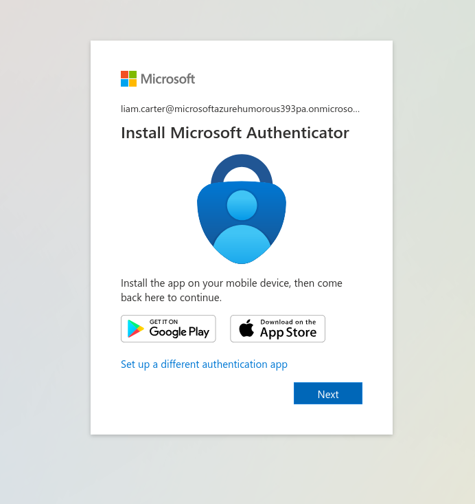
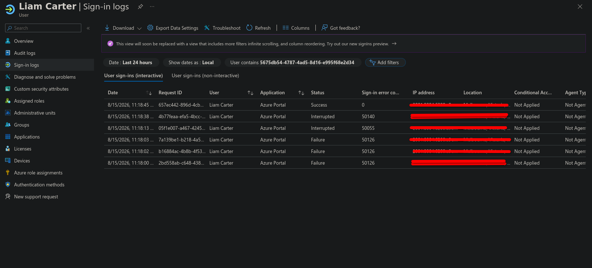
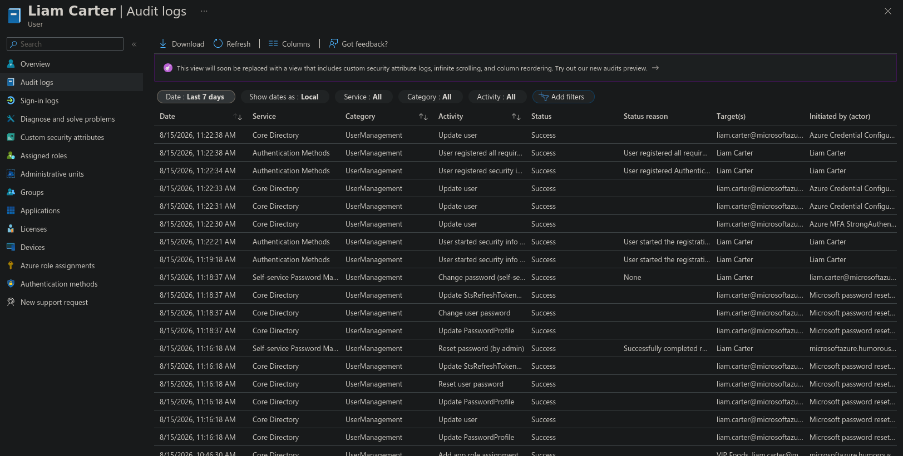

# Cybersecurity Capstone — VIP Events (Stage 4)

This is Stage 4 of the VIP Events cybersecurity capstone — the test plan for everything I built across [Stage 2](/blog/vip-events-stage-2-aad-setup/) and [Stage 3](/blog/vip-events-stage-3-roles-and-access/). Each test below specifies what's being validated, how, and what result should come back. Where it matters, I ran **negative cases** too — confirming access is correctly *denied* — because a least-privilege design only proves itself when isolation actively blocks out-of-scope access, not just when in-scope access happens to work. Everything was run against the live Entra ID Free-tier tenant, with notes wherever a test would look different under production licensing (P1/P2).

## Client app integration and authentication

First up: confirming the VIP Foods app actually authenticates users through Entra ID (SSO), and that it receives each user's assigned role correctly.

| Test | Method | Expected result |
|---|---|---|
| SSO authentication | Sign in to the VIP Foods app as a test user (e.g. Liam Carter) via Entra ID | User is redirected to the Entra sign-in page, authenticates, and is returned to the app — no separate credentials required |
| Role claim delivery | After sign-in, inspect the issued token's `roles` claim (decode the token, or review the enterprise app sign-in logs) | The token contains the user's assigned role value — e.g. Liam's token includes `HandleEquipmentRole` |
| Unassigned user | Attempt access as a user with no role assigned to the app | The token carries no VIP Foods role claim; the app grants no role-specific functionality |

Because the app reads the role straight out of the token claim at authorisation time, a passing role-claim test confirms the integration is actually using the custom roles I set up in Stage 3.

## User account validation

Next, I confirmed every account actually exists, is configured correctly, and carries accurate attributes — the identity work from Stage 2 checked against the live tenant.

| Test | Method | Expected result |
|---|---|---|
| Account existence | Review Entra ID → Users → All users | All expected staff accounts are present and enabled |
| Naming convention | Check each UPN | All follow `firstname.lastname@domain` consistently |
| Attribute accuracy | Open each user → Properties; verify department, job title, and manager | Attributes match the user's role (e.g. Ava Mitchell — department Kitchen, title Chef; Noah Bennett set as Liam Carter's manager) |
| Admin separation | Confirm the administrator account is not assigned to any employee security group | Admin identity is isolated from line-of-business groups |

This build has no on-premises directory, so there's no Entra Connect synchronisation to validate — "accurate synchronisation" here just means the attributes are correctly set in the cloud directory. In a hybrid production environment, synchronisation between on-prem AD and Entra ID would additionally be validated via the Entra Connect sync status and provisioning logs.

## Application role assignment

From there, I checked that every user is assigned to the correct role, and that access actually reflects that assignment.

| Test | Method | Expected result |
|---|---|---|
| Assignment accuracy | Review Enterprise applications → VIP Foods → Users and groups | Each user maps to their correct role (e.g. Ava → ChefRole, James → CEORole, Sofia → TempStaffRole) |
| Positive access | Sign in as each role user and access a function within that role's scope | Access granted to in-scope functionality |
| Assignment integrity | Confirm no user holds a role outside their job function | No unexpected or duplicate role assignments |

## Group/role-based access testing

This is the core of the test plan: validating that role-based access control both grants in-scope access and actively restricts out-of-scope access — proving the least-privilege isolation designed across Stages 1–3, not just assuming it.

| Role | Positive test (should succeed) | Negative test (should be denied) |
|---|---|---|
| HandleEquipmentRole (Liam) | View/update equipment records | Access kitchen, office, or admin functions; add/retire equipment |
| ChefRole (Ava) | View/update kitchen data | Access equipment, event, or admin functions; manage kitchen operations |
| HeadChefRole (Ethan) | Manage kitchen operations | Access equipment or office/admin functions |
| CateringManagerRole (Mia) | Event/catering planning; view kitchen data | *Update* kitchen data; access equipment internals or finance |
| OfficeWorkerRole (Chloe) | Administration and data management | Access operational or kitchen functions |
| CEORole (James) | Access all functional areas | (No restrictions — validate full access is present) |
| TempStaffRole (Sofia) | Perform assigned day-of task | Access any function beyond the assigned task |

I signed in as each role user, attempted both the in-scope and out-of-scope actions, and checked the result against the expected column. The negative tests are the critical validation here — they prove isolation is enforced, not merely configured. Any out-of-scope action that succeeds is a least-privilege failure that needs remediation.

In this Free-tier build, access is enforced via direct user-to-role assignment; under P1, group-to-role assignment would be tested to confirm that membership of a security group (e.g. SG-Chefs) automatically grants the corresponding role.

## MFA verification

Next, confirming MFA is actually enforced for every account, not just configured to look that way.

| Test | Method | Expected result |
|---|---|---|
| MFA enforcement | With Security Defaults enabled, sign in as a test user for the first time | User is required to register for MFA before access is granted |
| MFA challenge | Sign in as the administrator account | Admin is challenged for MFA on sign-in |
| Enforcement coverage | Confirm Security Defaults applies tenant-wide | All users, not a subset, are subject to MFA |

Signing in as Liam Carter for the first time triggered the MFA registration flow, confirming Security Defaults is enforcing MFA tenant-wide (see Figure 1).

*Figure 1: First sign-in as a test user triggers Microsoft Authenticator registration — Security Defaults enforcing MFA.*

Security Defaults is an all-or-nothing control. In production, MFA would instead be validated through granular Conditional Access policies (P1) — for example, confirming the CEO and admin accounts are always challenged, and that risky sign-ins trigger additional verification.

## Logging and monitoring

Last but not least: confirming the tenant actually captures the events needed to detect and investigate irregular activity.

| Log location | Captures | Test |
|---|---|---|
| Entra ID → **Sign-in logs** | Successful and failed sign-ins, MFA results, location/device | Perform a successful sign-in and a deliberately failed one; confirm both appear with correct status |
| Entra ID → **Audit logs** | Role assignments, group membership changes, user attribute changes, app configuration changes | Assign a role or change an attribute; confirm the action is recorded with actor, target, and timestamp |
| Entra ID → **Users → [user] → Sign-in logs** | Per-user sign-in history | Review an individual account's recent sign-ins |

The sign-in logs captured the full range of outcomes — a successful sign-in, several failures (error 50126, incorrect password), and MFA interrupts (see Figure 2). The audit logs recorded user updates, security-info registration, password changes, and — critically — the `Add app role assignment` event tying a user to a VIP Foods role (see Figure 3). Together these confirm the tenant logs the events needed to detect irregular activity such as repeated failed sign-ins, unexpected role changes, or sign-ins from unusual locations, and would feed a SIEM in production.

*Figure 2: Sign-in logs — a success, several failed attempts (error 50126), and MFA interrupts. IP and location redacted.*

*Figure 3: Audit logs — user updates, MFA registration, password changes, and an app role assignment to VIP Foods.*

## Documentation review

The final check: making sure the written proposal actually matches the deployed configuration, and that every step is recorded accurately enough to be useful later.

| Check | Method |
|---|---|
| Stage 1 vs build | Cross-verify the documented network zones, user groups, and role model against the tenant's groups and design intent |
| Stage 2 vs build | Confirm the tenant, user accounts, attributes, security groups, and Security Defaults match the documentation |
| Stage 3 vs build | Confirm the eight app roles, their values, and the user-to-role assignments match the documented role/permission model |
| Completeness | Confirm every configuration step is documented clearly enough to be reproduced or audited |
| Drift | Note any discrepancy between documentation and live state; update the documentation to reflect the true configuration |

This review closes the loop: the documentation is only useful for future management and audits if it accurately reflects what was actually built.

This test plan validated the VIP Events identity solution end to end: authentication and role-claim delivery, account and attribute accuracy, correct role assignment, enforced least-privilege access including negative tests, MFA enforcement, and the logging needed to detect irregular activity — with a final documentation review confirming the proposal matches the live build. The negative tests are the core of it: they confirm the isolation designed across Stages 1–3 actively restricts out-of-scope access, not merely that in-scope access works. Live evidence was captured for MFA enforcement and for the sign-in and audit logs.

---

*This is Stage 4 of a five-stage capstone. [Stage 1](/blog/vip-events-stage-1-company-requirements/) (company requirements), [Stage 2](/blog/vip-events-stage-2-aad-setup/) (Entra ID setup), and [Stage 3](/blog/vip-events-stage-3-roles-and-access/) (roles and access) precede it; [Stage 5](/blog/vip-events-stage-5-policy-implementation/) (policy implementation) follows — the final stage.*
