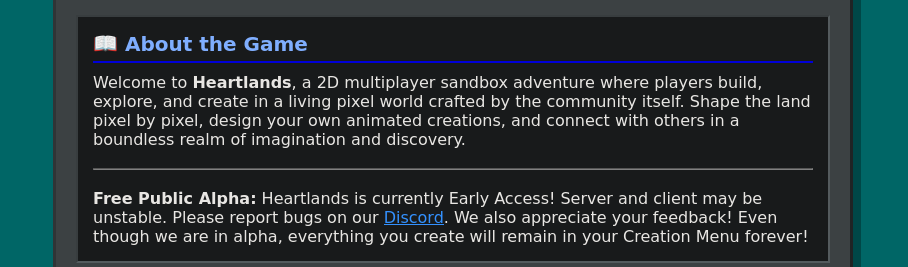
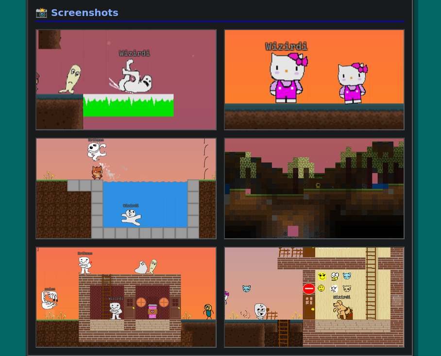
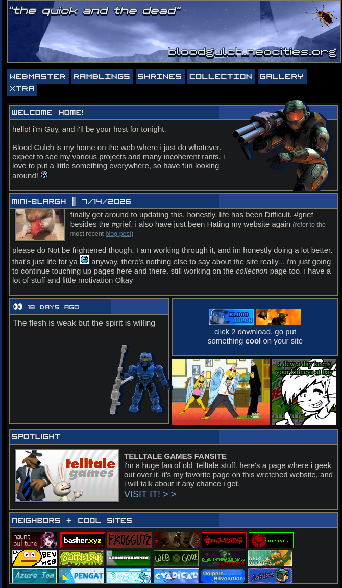

With every yin, there is a yang. One negative replaced with one positive, polar opposites that cannot exist without each other. In this instance, we have the dead internet theory - a term that has been growing since 2016 - which explores the concept that the digital environment we engross ourselves in is becoming increasingly dead with bots and AI-generated content (https://www.researchgate.net/publication/382118410_The_Dead_Internet_Theory_Investigating_the_Rise_of_AI-Generated_Content_and_Bot_Dominance_in_Cyberspace).

In the early stages of the internet, it is remembered as a unique freedom that was captured like the Wild West. You could see anything, create anything, you would go to Neopets or MySpace and make that part of the world uniquely yours - uniquely, you and while doing that you would find a link to other sites of human expression, you'd link that site, they'd link you and all of a sudden you're in a chat room with random humans somewhere in the world, watching them debate or getting lost in conversation before you close off the web browser not knowing if you'll ever come across them again. It's where most believe the internet really peaked but as platforms like Facebook, Instagram and Twitter grew, so did the distance of this virtual Wild West as it became a digital prison of data harvesting and a tracking system.

However, as this digital dystopia became more mainstream, so did that aforementioned polar opposite. The Web Revival Movement.

I didn't know this existed until one morning where I was doing my YouTube doomscroll looking for something that MIGHT interest me, and I was lucky enough to stumble across this video by onionboots that showed me this world still exists... or rather, it still existed but tucked away https://www.youtube.com/watch?v=tkUgOT22F5s, since exploring this, I started with the linked heartlands in the bio

and was immediately brought back to a childhood I forgot existed

Then I did some exploring, realised neocities.org is exactly what I remember. I started with https://bloodgulch.neocities.org/home  which outside of the classic Halo themes, also had the spotlight on Telltale's old games and the neighbours to other sites that linked bloodgulch and as you can see, bloodgulch linked them.

I could go on for hours about this movement, also called the "indie web development", but it's best if you explore this yourself https://emreed.net/LowTech_Directory (note: as stated on the site, it isn't regularly updated and some links sadly no longer work) or try: https://neocities.org/

As per usual though, it's the internet. Be careful with what you click on and remember that the content won't always be suitable for most audiences.

Down below are a few websites worth checking out:

https://ellesho.me/

https://greenbox.network/

https://e-vil.net/

https://melonking.net/

https://webring.dinhe.net/

https://aroundthefur.neocities.org/
